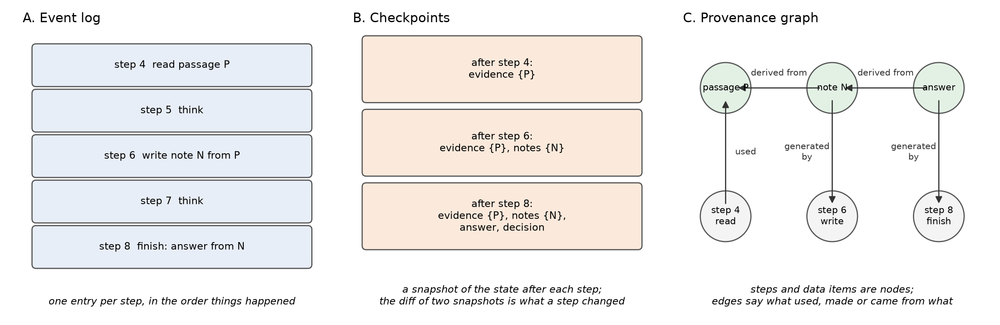
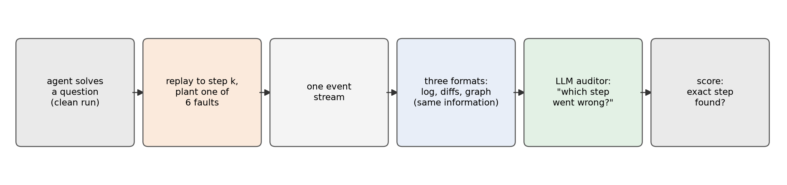
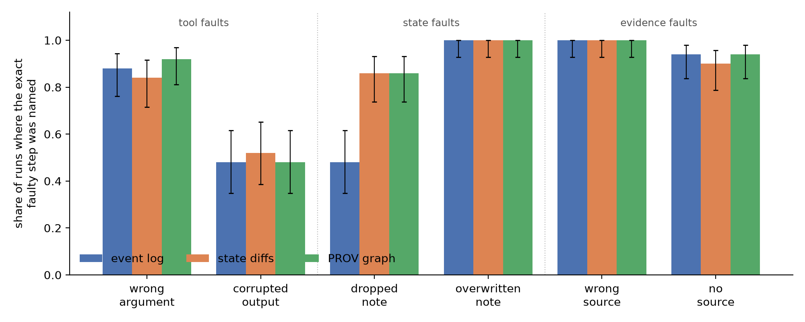
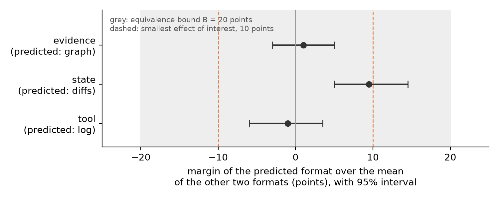
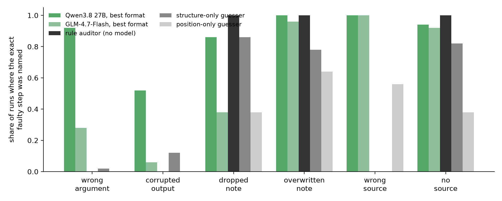
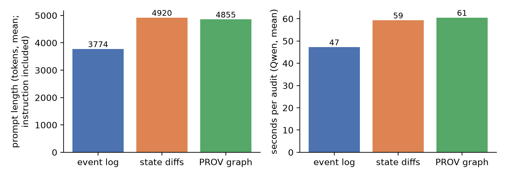

# Does the Shape of the Record Matter? Comparing Event Logs, State Diffs and Provenance Graphs for Finding Faults in LLM Agent Runs

**Ahmad Bin Shafiq**
Master's programme in Natural Language Processing, Trier University
Term paper, September 2026

---

## Abstract

When an AI agent does a task by calling tools, the system keeps a record so that someone can check the run later. Three kinds of record are common: an event log (one entry per step), checkpoints (snapshots of the agent's state; the difference between two snapshots is a state diff), and a provenance graph (what used and produced what). The three families have been compared in words, but we found no study that tests them side by side on the same audit task with the same information. We built one agent, recorded every run once, and wrote each run in all three shapes with exactly the same information. We then took 50 correct runs, planted each of six faults into each of them (300 faulty runs), and asked a language model to find the faulty step from each record. Our pre-registered hypothesis was that each fault class has a natural shape: the log for tool faults, the diffs for state faults, the graph for evidence faults. The data refuted this. Five of the six faults were found about equally well in all three shapes (no two shapes differed by more than 8 points). The exception is a dropped note, an action whose effect silently did not happen: found in 48% of event logs and 86% of diffs and graphs. A log shows a missing effect as nothing, and the auditor overlooked the nothing. Two further findings matter in practice: a one-line rule with no language model found three of the six faults perfectly, and the gap between a stronger and a weaker auditor was far larger than any gap between shapes. Code, data and the pre-registration are public.

---

## 1. Introduction

Language-model agents are programs that let a model decide what to do next: search something, read a page, write a note, call a tool, and so on, until the task is done. When such an agent makes a mistake, somebody has to find out where it went wrong. That person, or that program, is the **auditor**. The auditor cannot watch the agent live. It has to work from the **record** that the system kept while the agent ran.

There are three common ways to keep that record (Figure 1):

- An **event log** writes down every step, in order, as it happens. This is the "log-primary" family: the log is the truth, and the state of the agent can be rebuilt by replaying the log (Nakajima, 2026).
- A **checkpoint** system saves a snapshot of the agent's state after each step. Frameworks such as LangGraph do this to allow pausing, resuming and "time travel" (LangChain Inc, 2026). Comparing two snapshots shows what one step changed; that comparison is a **state diff**, and it is the form of this family that we show to the auditor.
- A **provenance graph** records what used what and what made what, as nodes and edges. The W3C PROV standard defines the vocabulary (Moreau and Missier, 2013a), and PROV-AGENT applies it to agents (Souza et al., 2025).



*Figure 1. The same five steps of an agent run in the three record families. In the log (A) each step is one entry. In the checkpoint view (B) each entry is the state after a step, and the difference between two entries is a state diff. In the provenance graph (C) steps and data items are nodes, and edges say what used, made or came from what.*

Each family has its advocates. Recent papers argue for logs (Nakajima, 2026), for checkpoints (T. Wu et al., 2026; Zhuang et al., 2026) and for provenance graphs (Souza et al., 2025; Kim et al., 2026). A 2026 survey of the field describes all three record forms, notes that a time-ordered log and a provenance graph are not the same thing, and lists realistic trace-level benchmarks as an open challenge (Wang et al., 2026). We found no study, there or elsewhere, that compares the three families side by side on an audit task. This paper is a first attempt at such a comparison, on one audit task: **failure localization**, the task of naming the step where a run went wrong.

The difficulty is that real systems differ in two ways at once: in *what* they record and in the *shape* of the record. A log that keeps the full text of every tool result and a checkpoint system that keeps only the chat messages cannot be compared fairly, because one has information the other does not. We remove that difference. We record every run once, as a single stream of events, and then write the same stream in three shapes. Each shape can be turned back into the stream without loss. What is left to compare is the shape alone.

Our question: **does the shape of the record change how well an auditor finds a planted fault, and does the best shape depend on the kind of fault?** Our hypothesis, locked before any run of the study was made, said yes: the log would be best for faults in tool calls, the diffs for faults in the agent's stored state, and the graph for faults in the sources the agent cites, because each family shows one of these things most directly.

The data refuted the hypothesis. This paper contributes:

1. A small harness, which anyone can run again, in which one recorded run is shown in three shapes that hold the same information; a lossless round trip (text back to events) is the proof of equality.
2. A pre-registered experiment (plan and analysis fixed and time-stamped before the data existed) with 300 faulty runs, six fault types, two auditors with public model weights, and three baselines that use no model.
3. The result that the shape matters little for five of six faults and much for one: a silently dropped action, which an event log shows as nothing.
4. The observation that a one-line rule matches or beats every language-model auditor on three of the six faults, and that a better auditor bought far more than a better shape.

All code, data, records, model answers and the pre-registration are in the project repository.

## 2. Background

### 2.1 What an agent run looks like

Throughout the paper we use one small running example. The agent must answer a question that needs several facts in a row, such as *"Where does the body of water by the city Astronautalis is from and the Ohio River meet?"* (the answer is Cairo, Illinois: Astronautalis is from Minneapolis, Minneapolis lies on the Mississippi, and the Mississippi meets the Ohio at Cairo) It works in rounds. In each round it **searches** for a passage, **reads** one, and **writes a note** with the fact it found and the passage it came from. When the notes hold the answer, it calls **finish**. Between any two actions it writes a short **think** text with its plan. A typical run has 20 to 26 steps.

Every step is written down as one **event** with five fields: the step number, the kind of step (think or act), the tool call, what the tool returned, and what the step changed in the agent's stored state. The stored state has a small number of sections: the think texts, the tool calls, the evidence (passages that were read), the notes, the answer and the final decision. Nothing lives only in the chat messages; everything the agent did is in the events.

### 2.2 The three record families, on the same step

Figure 1 shows the three families on a tiny run. Here is a real step from our data, step 12 of one run, in all three shapes. The agent has just read a passage about Minneapolis and writes a note.

**Event log.** One block per step. The `effect` line says what the step changed in the state.

```
step 12 | act | write_note
  call: {"key": "minneapolis_body_of_water", "text": "Minneapolis lies on the Mississippi River.", "source_pid": "6325312f070b"}
  return: {"ok": true}
  effect: ["add", "/notes/minneapolis_body_of_water"]
```

**State diffs.** The same step as the list of changes to the stored state, in the JSON Patch notation (Bryan and Nottingham, 2013). The first line stores the call; the second line is the note that appeared. The arguments are shortened here.

```
## step 12 (act)
{"op": "add", "path": "/calls/12", "value": {"tool_call": {"name": "write_note", "args": {...}}, "tool_return": {"ok": true}}}
{"op": "add", "path": "/notes/minneapolis_body_of_water", "value": {"text": "Minneapolis lies on the Mississippi River.", "source_pid": "6325312f070b"}}
```

**Provenance graph.** The same step in PROV-N, the W3C's text notation for PROV (Moreau and Missier, 2013b). The step is an activity, the note is an entity, and two edges say that the step generated the note and that the note was derived from the passage. The two dashes after `step:12` are PROV's empty start and end times, and `aa:op="add"` says the note was added.

```
activity(step:12, -, -, [aa:kind="act", aa:tool="write_note", aa:args="{...}", aa:return="{\"ok\": true}"])
entity(note:minneapolis_body_of_water@12, [aa:key="minneapolis_body_of_water", aa:op="add", aa:text="Minneapolis lies on the Mississippi River."])
wasGeneratedBy(note:minneapolis_body_of_water@12, step:12, -)
wasDerivedFrom(note:minneapolis_body_of_water@12, passage:6325312f070b, -, -, -)
```

The three texts hold the same facts. They differ in where the eye has to go. The log puts the call and its effect next to each other. The diffs show only what changed. The graph turns the note's source into an edge that can be followed.

### 2.3 Related work

**Finding the faulty step.** The task of naming the step where an agent run failed has several benchmarks. Who&When gives a language model the full chat log of a failed multi-agent run and asks which agent failed and at which step; and finds the step-level task hard for every model tested (Zhang et al., 2025). TRAIL annotates real execution traces in the OpenTelemetry format with error categories and locations (Deshpande et al., 2025). Who&When Pro plants faults into successful runs by replaying them to a chosen step and injecting one wrong action, so that the faulty step is known by construction (Liu et al., 2026); our fault-planting method adapts this recipe (Section 3.3). LongRCA studies long runs and scores answers within a window of steps (Zhang et al., 2026). CatchBench shows that such benchmarks can leak the answer through position alone: on one of its sources, a rule that reads only the order of the entries scores perfectly, because that order was never shuffled (Zhao et al., 2026). Our position-only guesser and our shuffle test (Section 3.5) guard against this leak.

**Does the record matter?** TraceElephant is the closest work to ours. It shows that giving the auditor a more complete trace (with inputs and metadata, not only outputs) raises step accuracy from 16% to 28% (Chen et al., 2026). That study varies *how much* is recorded. Every condition is log-shaped. TelemetrySuffBench masks attributes of synthetic telemetry traces and finds that standard telemetry views cripple localization (Zhu and Pu, 2026). Adaptive Influence Graphs build a graph from a log after the fact and report better attribution on Who&When (Bakish et al., 2026). ECHO and TrajDebug compress the record at different levels of detail depending on the distance from the step under review (Banerjee et al., 2025; Qi et al., 2026). None of these holds the information constant while changing the shape. That is the gap this paper fills.

**The three families as systems.** ActiveGraph makes the append-only event log the source of truth and rebuilds the graph of objects by replay; it reports no empirical evaluation of auditing (Nakajima, 2026). LangGraph's checkpointer saves the full state after each super-step and supports replay from any checkpoint (LangChain Inc, 2026). Crab extends checkpoints to the file system and to running processes, AgentRewind pairs the agent's context with a snapshot of the workspace files, and "Safe to Resume?" names five ways a rollback to a checkpoint can go wrong, from state the checkpoint never held to effects in the outside world that it does not record (T. Wu et al., 2026; Zhuang et al., 2026; G. Wu et al., 2026). PROV-AGENT records agent runs as W3C PROV graphs (Souza et al., 2025); LEDGER builds claim-to-evidence graphs for review (Kim et al., 2026); GRADE separates edges that were observed from edges that were inferred (Zhao, 2026). Two 2026 papers propose frameworks. Nian et al. (2026) define five dimensions of auditability with metrics; they back them with some measurements (a code scan of six agent projects and the run-time cost of their record-keeping) but audit no whole system on all five. Rasheed et al. (2026) propose claim-level provenance for research agents as a perspective, with no experiments. A third paper argues for reasoning provenance, a record of what the agent intended, saw and inferred, beyond state checkpoints and execution traces (Vispute and Kadam, 2026). The old systems literature on rollback recovery already contrasts log-based with checkpoint-based recovery (Elnozahy et al., 2002).

**What was missing.** Every benchmark above uses one record shape. Every system paper above argues for one family. No study we found keeps the information fixed and varies only the shape, and none tests whether the best shape depends on the kind of fault. The 2026 survey by Wang et al. reviews all three families and asks for trace-level benchmarks, but reports no such comparison.

## 3. Method

Figure 2 shows the whole pipeline. Before the first run of the study was made, we wrote down the whole plan, including the hypothesis, the faults, the auditor's instructions and the statistical test, and saved it with a time-stamped tag in the code repository. After that, nothing in the plan changed. This is called pre-registration, and we refer to that moment as the freeze. Everything after the freeze ran unattended on one laptop.



*Figure 2. The pipeline. A correct run is replayed to a chosen step, one fault is planted, and the run continues. The record is written in three shapes with the same information. An auditor names the faulty step from each shape.*

### 3.1 The agent and the task

**The task.** The questions come from MuSiQue (Trivedi et al., 2022), a dataset built so that each question can only be answered by chaining three or four facts. Take the example from Section 2.1: *"Where does the body of water by the city Astronautalis is from and the Ohio River meet?"* To answer it, the agent must find out that Astronautalis is from Minneapolis, then that Minneapolis lies on the Mississippi, then where the Mississippi meets the Ohio. Each fact is in a different passage, and no single passage gives the answer.

**What the agent can read.** The dataset gives each question about 20 short passages of Wikipedia text; some hold the facts, most are distractors. We put the passages of all our candidate questions together into one collection of 2,795 passages. The agent does not see this collection directly. It can only search it, the way you would search a small library with a keyword search box. The search engine is BM25 (Robertson and Zaragoza, 2009), a standard method that ranks passages by how many of the query's words they contain, with rare words counting more.

**The four tools.** The agent works only through these four actions:

| Tool | What it does | In the example |
|---|---|---|
| `search(query)` | returns the five best-matching passages, each with its title and first words | "Astronautalis hometown" returns five passages, one of them about Astronautalis |
| `read(handle)` | returns the full text of one passage | the agent reads the Astronautalis passage |
| `write_note(key, text, source)` | stores one fact, together with the passage it came from | note "city": "Astronautalis is from Minneapolis", source: that passage |
| `finish(answer, note)` | ends the run with the answer and names the note the answer rests on | answer "Cairo, Illinois", resting on the third note |

Between any two of these actions the agent writes a short think text with its plan. A typical run is therefore: think, search, think, read, think, write a note, and again for the next fact, until finish.

**One rule about repeats.** The tools refuse three kinds of repeat: sending the same search query twice, reading the same passage twice, and writing a note under a name that already exists. A refused call returns an error and changes nothing. We added this rule so that a correct run never contains, by accident, something that looks like one of the faults we plant later (for example, a note that overwrites another note). Later we plant one fault into each correct run and ask the auditor to find it. If a correct run already contained a repeat that looks like a fault, the auditor could rightly point at it, and our answer key would be wrong.

**The model behind the agent.** The agent's decisions are made by GLM-4.7-Flash (GLM-4.5 Team et al., 2025), run on one laptop through Ollama (Ollama, 2026); the think-and-act loop is built with LangGraph (LangChain Inc, 2026). The model runs at temperature 0, so that a run can be replayed exactly, and a run may take at most 38 steps.

**Two helps for a small model.** This model is not a strong question answerer, so we gave it two helps. First, with each question the agent also receives the dataset's own breakdown of the question into its sub-questions, without answers, as a plan. In a trial on the first 40 questions, the agent produced a usable run for 12% of them without the plan and for 30% with it (a rough comparison, because one small prompt setting also differed between the two trials). Second, every action the agent takes is written as a small, fixed-form JSON object, so an action can never be malformed. Both helps make the runs regular and short. Since this paper studies the auditor and not the agent, we accept that.

**Which runs enter the study.** We only plant faults into runs that are correct, because the auditor's job is to find *our* fault, not the agent's own mistakes. A run counts as correct, we say it **passes the gate**, when all five of these hold:

1. It ends with the right answer.
2. The answer rests on a passage that the dataset marks as one of the supporting passages.
3. Every note names a source passage.
4. Every note's source was actually read before the note was written.
5. Each of the six faults can be planted somewhere in the run (for example, the "overwritten note" fault needs at least two notes).

We ran the agent on candidate questions in a fixed order until 55 runs had passed the gate. That took 155 questions, so the pass rate was 35%. Three-hop questions (three facts in a chain) passed more often than four-hop questions: 46 of 106 against 9 of 49. The first five passing runs were set aside as a **development set**; we used them to try things out and to choose the auditor, and they appear in no result below. The other 50 runs are the study.

### 3.2 One stream, three shapes

Each run is recorded once as the event stream of Section 2.1. Three small programs write that stream as an event log, as state diffs and as a PROV graph, in the formats shown in Section 2.2. Each program has a reader that turns its text back into the event stream. On every record we produced (510 in all: the 155 candidate clean runs and the 355 faulty and sham runs, including those of the development questions), and for all three shapes, the reader returned exactly the original stream. All 345 records audited in the study (300 faulty, 25 clean, 20 sham) are among them. This **round trip** is our proof that the three shapes hold the same information. Whatever difference we find between them is a difference of shape, not of content.

The shapes differ in length. What the auditor reads (the record plus the instruction) is about 3,800 tokens for a log and about 4,900 tokens for the diffs or the graph; roughly 600 to 700 of these are the shared instruction and the reading note. The diffs are longer than the log because the stored state holds the text of a passage twice, once in the tool return and once in the evidence section. The graph is longer because the PROV notation writes every call and return as an escaped string and needs one extra line for every think text and every edge. Length is therefore tied to shape and cannot be separated from it in this design.

### 3.3 Planting faults

A **fault** is one wrong thing that happens at one step of an otherwise correct run. We plant it with the warm-start recipe of Who&When Pro (Liu et al., 2026): we replay the clean run up to step k − 1 (every model reply is cached and the tools are fixed lookups, so the replay is byte-identical), do something wrong at step k, and let the agent continue live from there. Our recipe differs from theirs in three ways: the fault comes from a tool wrapper rather than from a wrong action written by the model, we cache the model's replies rather than the tool outputs, and we add sham runs (below). The faulty step is therefore known exactly, and the record before step k is provably identical to the clean run. Table 1 lists the six faults. Each class has two faults. Each fault is planted once per question, at a step chosen by a fixed formula from the question's position and the fault's number, so that early, middle and late positions are balanced and nothing is chosen by hand.

*Table 1. The six planted faults.*


| Class    | Fault            | What happens at step k                                                                                                          |
| -------- | ---------------- | ------------------------------------------------------------------------------------------------------------------------------- |
| tool     | wrong argument   | the tool is called with a different argument than the plan just before it said (a stale query, or the wrong passage)            |
| tool     | corrupted output | the tool is called correctly, but returns unrelated content (results from far down the ranking, or the text of another passage) |
| state    | dropped note     | `write_note` returns "ok", but no note is stored                                                                                |
| state    | overwritten note | `write_note` stores its text under an existing note's name instead of the new one                                               |
| evidence | wrong source     | the note names the passage read before the right one as its source                                                              |
| evidence | no source        | the note has no source at all                                                                                                   |


A seventh kind of run is the **sham**: the fault machinery is switched on but changes nothing, like a placebo. A sham record is byte-identical to the clean record. Sham runs and clean runs together are the **control runs**, on which the right answer is "there is no fault". The study has 45 of them: the clean runs of the first 25 study questions and sham runs of the last 20 (the pre-registration fixed this rule).

The word "clean" needs one caveat. A small agent makes small natural mistakes even in a run that ends correctly: it may plan a search and then write a note, or write a note that the passage does not quite support. Our gate removes only mistakes that look like our planted faults. The others stay, and a good auditor will sometimes point at them.

### 3.4 The auditor

The auditor is a language model that receives one shared instruction, one short note on how to read the given shape, and the record. The instruction describes the four tools and the six faults in plain words and asks for the first step where something went wrong. The reading note explains only the syntax of the shape (what a line, an operation, a node and an edge are) and names no fault. The three notes differ in length by less than 20%. The auditor answers in a fixed JSON form: a short analysis, the faulty step or null, the fault class and type, and a short quote from the record as a pointer.

The primary auditor is Qwen3.8 27B (Qwen Team, 2026), an open-weights model run locally at temperature 0 with no hidden reasoning. It did not produce the runs. A second auditor, the same GLM model that acted as the agent, audited every run as well. Its results are description only: they are not part of the pre-registered test. We chose Qwen as the primary auditor in the pilot on the development set, where GLM as auditor called 11 of 15 clean records faulty. To check that one answer per record is enough, we audited six development records three times each with the model reloaded in between; both models gave byte-identical answers every time. The full prompt is in the pre-registration.

### 3.5 How we score, and how we decide

**The score.** For every faulty run and every shape, the auditor gives one answer: a step number, or "no fault". We score it as a hit only if the step number is exactly the step where we planted the fault. Everything else is a miss, including "no fault" and an answer that could not be read. The share of hits is the number we report everywhere below. Two looser scores are reported as well: whether the answer was within three steps of the fault (a window score, as in LongRCA; Zhang et al., 2026), and whether the auditor named the right fault class (TRAIL scores the category in the same way; Deshpande et al., 2025). On the control runs, where there is no fault, we count how often the auditor claimed one anyway: the **false-alarm rate**.

**Three baselines without a model.** To see how much of the auditor's score is real skill, we compare it with three guessers that use no language model:

- The **position-only guesser** never sees the record. It only knows how long the run is, and it names the step where faults most often sat in the other questions. It exists because CatchBench showed that a benchmark can leak the answer through position alone (Zhao et al., 2026).
- The **structure-only guesser** sees the record with every piece of text blanked out: only the step kinds, tool names and the shape of each change remain. It names the step that looks most unusual among the steps of the same tool.
- The **rule auditor** is one line of logic: name the first note step that did not add a note with a source.

**The one test.** The freeze (see the start of this section) fixed one statistical test, and we ran only that one. The test asks: does the effect of the shape change from one fault class to another? If the log is best for tool faults but the diffs are best for state faults, the answer is yes, and that is what the hypothesis predicted. (For readers who want the details: a mixed-effects logistic regression of the hit score on shape, fault class and their interaction, with random intercepts for question and run, fitted with lme4; Bates et al., 2015. The random intercepts let some questions and some runs be harder than others.)

**The margins.** The test says whether shape and class interact, not by how much. So for each class we also report a **margin**: how many percentage points better the predicted shape did than the average of the other two. Each margin comes with a 95% interval, which says how much it would move if we had drawn a different set of 50 questions. We get the interval by re-drawing the questions many times and recomputing the margin (a bootstrap).

**When a prediction counts as met.** Before the study we fixed three conditions, and all three must hold: the margin is at least 10 points, its interval does not include zero, and the predicted shape is strictly the best of the three in its class.

**What the study can and cannot show.** Before running it, we simulated the whole study many times with made-up data. This told us that the test detects a true 10-point pattern in 94% of cases and raises a false alarm in 5%. It also told us that with 50 questions a "no difference" result can only mean "no difference larger than 20 points"; we cannot rule out smaller ones (this is an equivalence bound, in the sense of Lakens, 2017).

**Three safety checks.** Three checks were also fixed before the study, and the result only counts if all three pass. They did.

1. Every sham record is byte-for-byte identical to the clean record it came from.
2. The structure-only guesser scores near its expected floor on the two tool faults, which shows that those faults do not leak through the record's structure.
3. The auditor's real score beats what it would get if the fault positions were shuffled among the runs of the same fault type (we shuffled 2,000 times; the real score had to beat 97.5% of the shuffled ones). This shows that the auditor is reading the record and not guessing from position.

### 3.6 Compute

Everything ran on one laptop with 48 GB of memory, with no paid API. Generating the 155 candidate runs took 3.8 hours of model time, the 320 faulty and sham runs about one more hour, and the 2,070 audits about 20 hours (3.7 for GLM, 16.1 for Qwen). Anyone with a similar machine can repeat the study.

## 4. Results

### 4.1 The runs

The 300 faulty runs have 23.8 steps on average. In 263 of them the agent still reached `finish`; 37 hit the step limit. The planted fault changed the final answer in 20% of the runs: never for a dropped or overwritten note (by design: the agent only ever sees what a tool returns, and `write_note` still returns "ok", so these two faults cannot change what it does next), in 14 to 20% of the evidence faults, in 36% of wrong arguments and in 50% of corrupted outputs. So most faults were silent: the run went on and ended as if nothing had happened, which is exactly the case where an audit record is needed.

### 4.2 The main result

Figure 3 and Table 2 show how often the primary auditor named the exact faulty step, per fault and shape.



*Figure 3. Share of the 50 runs per fault in which the primary auditor (Qwen3.8 27B) named the exact faulty step, by record shape. Error bars are 95% Wilson intervals (Wilson, 1927), the usual interval for a share out of a small count.*

*Table 2. Exact step found by the primary auditor, 50 runs per cell.*


| Fault            | event log | state diffs | PROV graph |
| ---------------- | --------- | ----------- | ---------- |
| wrong argument   | 0.88      | 0.84        | 0.92       |
| corrupted output | 0.48      | 0.52        | 0.48       |
| dropped note     | **0.48**  | **0.86**    | **0.86**   |
| overwritten note | 1.00      | 1.00        | 1.00       |
| wrong source     | 1.00      | 1.00        | 1.00       |
| no source        | 0.94      | 0.90        | 0.94       |
| all faults       | 0.80      | 0.85        | 0.87       |


Over all faults the auditor found the exact step in 84% of the records, and 99% of its answers parsed. Five of the six faults were found about equally well in all three shapes; their differences are within a few points and inside the intervals. The exception is the dropped note. In the event log the auditor found it in 24 of 50 runs; in the diffs and in the graph in 43 of 50.

The pre-registered test says that the effect of the shape does depend on the fault class; the chance of seeing a pattern this strong with no real dependence is far below one in a thousand (p < 0.0001). But the pattern is not the predicted one. Figure 4 shows the three margins.



*Figure 4. For each fault class, the margin of the predicted shape over the mean of the other two, with 95% bootstrap intervals. The hypothesis needed all three margins to lie above 10 points.*

- **Tool faults, predicted best: the log.** Margin −1 point, interval −6 to +4. No difference.
- **State faults, predicted best: the diffs.** Margin +9.5 points, interval +5 to +14.5. The diffs do beat the log, but the margin falls just short of the 10-point minimum, and the graph does exactly as well, so the diffs are not the single best shape. The prediction is not met on either count.
- **Evidence faults, predicted best: the graph.** Margin +1 point, interval −3 to +5. Every shape is at 95% or above, so this prediction could not be tested: there was no room for any shape to be better.

Under the decision rules fixed before the study, the label is **"refuted: another interaction"**. The shape matters, but only for one fault, and not in the way the hypothesis said.

### 4.3 The dropped note: a log shows an absence as nothing

The whole interaction comes from one cell. Why is a dropped note so hard to see in the log? Here is step 12 of the run from Section 2.2 with the fault planted. The agent asked to write the note, the tool said "ok", and nothing was stored.

In the **event log** the faulty step reads:

```
step 12 | act | write_note
  call: {"key": "minneapolis_body_of_water", "text": "Minneapolis lies on the Mississippi River.", "source_pid": "6325312f070b"}
  return: {"ok": true}
```

The clean version of the same step has one more line, `effect: ["add", "/notes/minneapolis_body_of_water"]`. The fault is that this line is missing. Nothing in the block says so.

In the **state diffs** the same step reads:

```
## step 12 (act)
{"op": "add", "path": "/calls/12", "value": {"tool_call": {"name": "write_note", ...}, "tool_return": {"ok": true}}}
```

Every other note step in the record has a second line that adds a note. This one has only the stored call. The gap is visible because the diff format is *about* what changed, and here nothing changed.

In the **PROV graph** the step is an activity with no `wasGeneratedBy` edge and no note entity, while every other note step has both. Again the absence is visible as a missing piece of a pattern.

On this run the auditor answered "no fault" for the log and "step 12, state fault" for the diffs and the graph. This was the typical outcome: of the 26 log records with a dropped note that the auditor got wrong, in 17 it said the run was clean, in 8 it named another step, and in one it ran out of output tokens before giving an answer. The log did not hide the information. The round trip proves it is there. But it is there as the absence of a line, and the auditor did not notice the absence.

### 4.4 Baselines: what a rule can do

Figure 5 puts the auditor next to the three no-model baselines and next to the second auditor.



*Figure 5. Exact step found per fault: the two language-model auditors (their best shape each) against three baselines that use no model.*

The **rule auditor**, one line of logic, found the dropped note, the overwritten note and the missing source in 50 of 50 runs each, and nothing else. These three faults are structural: the record's shape alone gives them away. The **structure-only guesser**, which sees no text at all, found them in 78 to 86% of runs. For these faults a language model adds nothing that a rule does not already give. The rule costs nothing and runs in an instant. On the 300 faulty runs and the 45 control runs it never named a wrong step: it found the three structural faults every time and stayed silent on everything else. Its silence on clean runs is partly by construction, because our gate (Section 3.1) already removed clean runs with a note that has no source.

The other three faults need the text. A wrong argument is visible only against the plan just before it; a corrupted output only against the query; a wrong source only by reading the note and the passage. Here the structure-only guesser scores near zero (0 to 12%). The position-only guesser scores nothing on the two tool faults; it scores 56% on the wrong source only because that fault needs an earlier passage to point to, so it never sits on the first note and almost always sits on step 12 or 18. The auditor's 48 to 100% on these three faults is real work.

The **position-only guesser** deserves a note. Because the runs are short and regular, planted faults sit on few steps: step 12 in a quarter of all runs. A guesser that never sees the record therefore scores 33% over all faults, and 56 to 64% on some. This is the honest floor for any auditor on this harness, and it is the reason the pre-registered controls use the shuffle test of Section 3.5 rather than "near chance".

### 4.5 Controls and false alarms

The three pre-registered controls passed: every sham record was byte-identical to its clean record; the structure-only guesser found only 7 of 100 tool faults, well under its bound; and in the shuffle test the auditor's real score of 0.84 is far above 0.31, the point that 97.5% of the shuffled scores stay below.

On the 45 control runs the auditor raised a false alarm in 15 (log), 14 (diffs) and 18 (graph) of them, between 31 and 40%, with overlapping intervals and so no clear difference between shapes. As explained in Section 3.3, many of these are the auditor pointing at a real small mistake of the agent that our gate did not remove: in the pilot we checked such cases by hand and found, for example, a plan that said "I will search" followed by a note, and a note that the passage did not support. The false-alarm rate therefore measures "the auditor flags something", not only auditor error. The auditor also said "no fault" on some faulty runs: 34 of 300 in the log, 10 in the diffs and 8 in the graph. Most of these are the dropped note in the log (17) and the corrupted output in all shapes (13, 6 and 8).

### 4.6 The second auditor

The second auditor, GLM-4.7-Flash, is the same model that acted as the agent. It found the exact step in 54% of records overall, against 84% for Qwen. It was near zero on tool faults (4 to 16% per shape), moderate on state faults (58 to 62%) and good on evidence faults (83 to 94%). For this auditor too, the effect of the shape depends on the fault class (p = 0.0009), but the pattern is different again: it did worst with the log on tool faults and did not show the dropped-note gap (26 to 38% in every shape, near the position-only guesser). We read this as: a weak auditor is noisy in all shapes, and its noise does not follow the shape. In the pilot on the development set, the same model as auditor flagged 11 of 15 clean records as faulty and, with hidden reasoning switched on, failed to produce any answer in a third of the calls.

### 4.7 Secondary observations

- **Symptom versus cause.** When the auditor named a wrong step, in 80% of cases it named a later step than the fault. It saw the damage, not the cause. This held in all three shapes.
- **Position.** Accuracy did not depend much on whether the fault sat early, in the middle or late in the run (log 0.77, 0.79, 0.82; diffs 0.82, 0.91, 0.84; graph 0.84, 0.90, 0.86).
- **Length and time.** The log is the shortest shape and the fastest to audit (47 seconds against 59 and 61 with Qwen), and it did not do better for it (Figure 6). Our records are all short (under 8,500 tokens); Liu et al. (2026) report that step accuracy of LLM auditors drops from 94% on traces under 3,000 tokens to 50% on traces over 12,000, so length may matter more in longer runs than it could here.
- **Looser scores.** Counting answers within three steps of the fault raised every shape by 2 to 4 points and changed no conclusion. The right fault class was named in 82% (log), 88% (diffs) and 88% (graph) of the records.



*Figure 6. Length of what the auditor reads (record plus instruction) and audit time per shape. The log is about a quarter shorter and audited about a fifth faster.*

## 5. Discussion

**The shape of the record matters less than expected.** With the information held equal, a capable auditor found five of six faults about equally well from a log, from state diffs and from a provenance graph. The predicted match between fault class and record family did not appear. In particular, the provenance graph did not help with evidence faults, because those faults were easy in every shape: in a short, regular run the true source of a note is always the passage read two steps before, and the wrong source stands out whether it is a string in a log or an edge in a graph. Our design made these faults too easy to separate the shapes; a longer or less regular run might not.

**But a log shows an absence as nothing.** The one large effect is instructive. An event log is a list of things that happened. A thing that *should* have happened and did not is, in a log, simply a line that is not there. The diff and the graph are both shapes that describe *effects*, and an effect that is missing breaks a visible pattern: a note step without a note. This suggests a practical rule for anyone who designs an audit record: do not only log actions, log their effects, and make the log show when an action had no effect. In our harness a single extra line, "no note was stored", would make the dropped note as visible in the log as in the other shapes. That is a small change to the log family, not a reason to switch families.

**For structural faults, use a rule, not a model.** Three of the six faults were found perfectly by one line of logic; a guesser that sees only positions found them in 38 to 64% of runs, and a guesser that sees only structure in 78 to 86%. Where a fault is a broken pattern in the record's structure, a check that runs on every record for free should come first, and a language model should be reserved for faults that need reading: a call that contradicts the plan, a result that does not fit the query, a claim that the cited passage does not support.

**In our study, the auditor mattered more than the record.** Between the two auditors the difference was 30 points overall and up to 80 points on tool faults. Between the three shapes it was 7 points overall. A small model as auditor produced noise in every shape and could not be trusted to say "this run is clean". We tried only two auditors, so anyone building an agent system should check that this holds for their own auditor before spending effort on the record format.

**What this means for the three families.** Our results do not say that logs, checkpoints or provenance capture are better or worse systems. They say that once the same information is present, the way it is written down changes the auditor's success in one specific and understandable way. Real systems in these families differ in what they capture, and that, as TraceElephant showed for logs, matters a great deal (Chen et al., 2026). The advantage that the provenance literature claims for graphs, that "what came from what" is explicit, did not show up here, because our log and diffs carried the same links as strings and the auditor followed them just as well.

## 6. Limitations

- **One agent, one dataset, short regular runs.** The agent works in fixed rounds, gets the sub-questions as a plan, and produces runs of about 24 steps. Faults therefore sit on few steps, and some faults are easy in every shape. Longer, messier runs would be a harder and fairer test, especially for the graph.
- **Six synthetic faults, two per class.** The fault classes were chosen to match the record families, and the faults and the shapes were built by the same person. The results hold for these faults and say nothing about faults we did not plant.
- **"Clean" runs are not perfectly clean.** The false-alarm rate mixes auditor error with real small mistakes of the agent.
- **Renderings, not systems.** The three shapes are three ways to print one recorded run. They are not three deployed recording systems with their own coverage, cost and failure modes.
- **One primary auditor.** A different or stronger model might react to the shapes differently. The second auditor was too weak to tell.
- **Length is tied to shape.** The log is shorter than the other two; we cannot separate the effect of length from the effect of shape in this design.
- **Power.** With 50 questions the study can detect differences of about 10 points in the interaction test, but a null result can only rule out differences above 20 points.
- **Most related work is unreviewed.** Of the 34 sources we cite, 16 are 2026 arXiv preprints, 2 more are 2025 arXiv preprints, and one is a workshop paper without proceedings. Two of the preprints report acceptance at a venue that had not yet published them. We cite what the papers say, not what they have been confirmed to show.

## 7. Conclusion

We asked whether the shape of an audit record, an event log, state diffs or a provenance graph, changes how well an auditor finds a planted fault, once the information in the record is held equal. We planted each of six faults into 50 correct runs of one agent (300 faulty runs), wrote every run in all three shapes, and asked a local language model to find the faulty step. The pre-registered hypothesis, that each fault class has its natural shape, was refuted. Five faults were found about equally well in every shape; the differences were 8 points at most, and with 50 runs per cell the study can only rule out differences above 20 points. One fault, an action whose effect silently did not happen, was found in 48% of event logs and 86% of diffs and graphs, because a log shows a missing effect as nothing. A one-line rule found three of the six faults perfectly without any model, and with the two auditors we tried, the gap between the stronger and the weaker one (30 points overall) was much larger than the gap between shapes (7 points).

The practical advice is simple. Record effects, not only actions, and make the record show when an action had no effect. Check the record's structure with rules before asking a model. And choose the auditor before choosing the format.

## References

Every entry was checked against its source page (arXiv, publisher or repository) on 2026-09-20 and again on 2026-09-22. "Preprint" means that the paper had not appeared in a peer-reviewed venue on that date.

Bakish, Y., Dudai, A., Ganz, R., Nuriel, O., Ben Avraham, E., Shpigel Nacson, M., and Litman, R. (2026). Adaptive Influence Graphs for Failure Attribution in Multi-Agent Systems. arXiv:2608.24361 (preprint). [https://arxiv.org/abs/2608.24361](https://arxiv.org/abs/2608.24361)

Banerjee, A., Nair, A., and Borogovac, T. (2025). Where Did It All Go Wrong? A Hierarchical Look into Multi-Agent Error Attribution. arXiv:2510.04886 (NeurIPS 2025 workshop "Evaluating the Evolving LLM Lifecycle"; non-archival). [https://arxiv.org/abs/2510.04886](https://arxiv.org/abs/2510.04886)

Bates, D., Mächler, M., Bolker, B., and Walker, S. (2015). Fitting Linear Mixed-Effects Models Using lme4. Journal of Statistical Software, 67(1), 1–48. [https://doi.org/10.18637/jss.v067.i01](https://doi.org/10.18637/jss.v067.i01)

Bryan, P., and Nottingham, M. (eds.) (2013). JavaScript Object Notation (JSON) Patch. RFC 6902, Internet Engineering Task Force. [https://www.rfc-editor.org/rfc/rfc6902](https://www.rfc-editor.org/rfc/rfc6902)

Chen, M., Wang, J., Mu, F., Wang, Y., Liu, Z., Feng, H., and Wang, Q. (2026). Seeing the Whole Elephant: A Benchmark for Failure Attribution in LLM-based Multi-Agent Systems. Proceedings of the 64th Annual Meeting of the Association for Computational Linguistics (Volume 1: Long Papers), 19888–19905. [https://doi.org/10.18653/v1/2026.acl-long.912](https://doi.org/10.18653/v1/2026.acl-long.912)

Deshpande, D., Gangal, V., Mehta, H., Krishnan, J., Kannappan, A., and Qian, R. (2025). TRAIL: Trace Reasoning and Agentic Issue Localization. arXiv:2505.08638 (preprint). [https://arxiv.org/abs/2505.08638](https://arxiv.org/abs/2505.08638)

Elnozahy, E. N., Alvisi, L., Wang, Y. M., and Johnson, D. B. (2002). A survey of rollback-recovery protocols in message-passing systems. ACM Computing Surveys, 34(3), 375–408. [https://doi.org/10.1145/568522.568525](https://doi.org/10.1145/568522.568525)

GLM-4.5 Team, Zeng, A., Lv, X., Zheng, Q., and others (2025). GLM-4.5: Agentic, Reasoning, and Coding (ARC) Foundation Models. arXiv:2508.06471 (preprint). The GLM-4.7-Flash model card asks for this citation ([https://huggingface.co/zai-org/GLM-4.7-Flash](https://huggingface.co/zai-org/GLM-4.7-Flash)); the model used here is glm-4.7-flash:q8_0 on Ollama. [https://arxiv.org/abs/2508.06471](https://arxiv.org/abs/2508.06471)

Kim, D., Miao, H., and Liu, S. (2026). LEDGER: Claim-to-Evidence Trace Graphs for Auditing LLM Agents. arXiv:2608.18398 (preprint). [https://arxiv.org/abs/2608.18398](https://arxiv.org/abs/2608.18398)

Lakens, D. (2017). Equivalence Tests: A Practical Primer for t Tests, Correlations, and Meta-Analyses. Social Psychological and Personality Science, 8(4), 355–362. [https://doi.org/10.1177/1948550617697177](https://doi.org/10.1177/1948550617697177)

LangChain Inc (2026). LangGraph, version 1.2.11. Software. [https://github.com/langchain-ai/langgraph](https://github.com/langchain-ai/langgraph)

Liu, J., Xi, H., Zhang, S., Zeng, Y., Yue, T., Wang, C., Kang, J., Wu, Q., and Wang, H. (2026). Who&When Pro: Can LLMs Really Attribute Failures in AI Agents?. arXiv:2607.09996 (preprint). [https://arxiv.org/abs/2607.09996](https://arxiv.org/abs/2607.09996)

Moreau, L., and Missier, P. (eds.) (2013a). PROV-DM: The PROV Data Model. W3C Recommendation, World Wide Web Consortium (W3C). [https://www.w3.org/TR/prov-dm/](https://www.w3.org/TR/prov-dm/)

Moreau, L., and Missier, P. (eds.) (2013b). PROV-N: The Provenance Notation. W3C Recommendation, World Wide Web Consortium (W3C). [https://www.w3.org/TR/prov-n/](https://www.w3.org/TR/prov-n/)

Nakajima, Y. (2026). The Log is the Agent: Event-Sourced Reactive Graphs for Auditable, Forkable Agentic Systems. arXiv:2605.21997 (preprint). [https://arxiv.org/abs/2605.21997](https://arxiv.org/abs/2605.21997)

Nian, Y., Yuan, A., Zhang, H., Li, J., Li, L., Hu, X., Wei, H., Xiao, X., Xiao, C., and Zhao, Y. (2026). Auditable Agents. arXiv:2604.05485 (preprint; the arXiv version is the 24-page extended version; the authors report a condensed version in the Proceedings of the ACM AI Leadership Summit 2026, not confirmed). [https://arxiv.org/abs/2604.05485](https://arxiv.org/abs/2604.05485)

Ollama (2026). Ollama, version 0.33.2. Software. [https://github.com/ollama/ollama](https://github.com/ollama/ollama)

Qi, Y., Yin, Z., Shi, X., Peng, H., Lu, S., Liu, Y., Xuan, R., Liu, Y., Hu, Z., Wang, X., Hou, L., Xu, B., and Li, J. (2026). TRAJDEBUG: Tracing Error Lifecycle to Identify Critical Failures in Long-Horizon Agent Trajectories. arXiv:2608.06346 (preprint; the authors report acceptance to Findings of EMNLP 2026, not yet confirmed in the ACL Anthology). [https://arxiv.org/abs/2608.06346](https://arxiv.org/abs/2608.06346)

Qwen Team (2026). Qwen3.8-Max: A New Bar for Coding and Cowork. Blog post; the model used here is Qwen3.8-27B ([https://huggingface.co/Qwen/Qwen3.8-27B](https://huggingface.co/Qwen/Qwen3.8-27B)), tag qwen3.8:27b on Ollama. [https://qwen.ai/blog?id=qwen3.8](https://qwen.ai/blog?id=qwen3.8)

Rasheed, R. A., Banerjee, S., Mukherjee, A., and Hazra, R. (2026). From Fluent to Verifiable: Claim-Level Auditability for Deep Research Agents. arXiv:2602.13855 (preprint). [https://arxiv.org/abs/2602.13855](https://arxiv.org/abs/2602.13855)

Robertson, S., and Zaragoza, H. (2009). The Probabilistic Relevance Framework: BM25 and Beyond. Foundations and Trends in Information Retrieval, 3(4), 333–389. [https://doi.org/10.1561/1500000019](https://doi.org/10.1561/1500000019)

Souza, R., Gueroudji, A., DeWitt, S., Rosendo, D., Ghosal, T., Ross, R., Balaprakash, P., and Ferreira da Silva, R. (2025). PROV-AGENT: Unified Provenance for Tracking AI Agent Interactions in Agentic Workflows. 2025 IEEE International Conference on eScience (eScience), 467–473. [https://doi.org/10.1109/eScience65000.2025.00093](https://doi.org/10.1109/eScience65000.2025.00093)

Trivedi, H., Balasubramanian, N., Khot, T., and Sabharwal, A. (2022). MuSiQue: Multihop Questions via Single-hop Question Composition. Transactions of the Association for Computational Linguistics, 10, 539–554. [https://doi.org/10.1162/tacl_a_00475](https://doi.org/10.1162/tacl_a_00475)

Vispute, N., and Kadam, A. (2026). Reasoning Provenance for Autonomous AI Agents: Structured Behavioral Analytics Beyond State Checkpoints and Execution Traces. arXiv:2603.21692 (preprint). [https://arxiv.org/abs/2603.21692](https://arxiv.org/abs/2603.21692)

Wang, Y., Zhang, J., Wu, Z., Cai, T., Liu, Z., Sun, Z., Dong, M., Zheng, M., Duan, Y., Yin, X., and Zhu, Y. (2026). From Agent Traces to Trust: A Survey of Evidence Tracing and Execution Provenance in LLM Agents. arXiv:2606.04990 (preprint). [https://arxiv.org/abs/2606.04990](https://arxiv.org/abs/2606.04990)

Wu, G., Li, D., Jiang, K., Niu, J., Wang, C., and Zhang, Y. (2026). Safe to Resume? Breaking Execution Continuity of Agent Execution via Rollback. arXiv:2608.29381 (preprint). [https://arxiv.org/abs/2608.29381](https://arxiv.org/abs/2608.29381)

Wu, T., Chang, C., Cao, L., Gao, W., and Wang, W. (2026). Crab: A Semantics-Aware Checkpoint/Restore Runtime for Agent Sandboxes. arXiv:2604.28138 (preprint). [https://arxiv.org/abs/2604.28138](https://arxiv.org/abs/2604.28138)

Zhang, S., Yin, M., Zhang, J., Liu, J., Han, Z., Zhang, J., Li, B., Wang, C., Wang, H., Chen, Y., and Wu, Q. (2025). Which Agent Causes Task Failures and When? On Automated Failure Attribution of LLM Multi-Agent Systems. Proceedings of the 42nd International Conference on Machine Learning, Proceedings of Machine Learning Research 267, 76583–76599. [https://proceedings.mlr.press/v267/zhang25cq.html](https://proceedings.mlr.press/v267/zhang25cq.html)

Zhang, Y., Feng, B., Pei, C., Wang, Z., Peng, Z., Liu, X., Jiang, H., Ma, D., Zhang, J., Yao, Y., Zhao, Y., Sun, F., Huo, Y., Liu, Z., Li, J., Xie, G., and Pei, D. (2026). LongRCA Bench: Root-Cause Localization in Long-Horizon Agent Trajectories. arXiv:2608.15242, v4 (preprint; v1 to v3 had the title "LongRCA Bench: Diagnosing Responsible Roles and Root Causes in Long-Horizon Agent Failures"). [https://arxiv.org/abs/2608.15242](https://arxiv.org/abs/2608.15242)

Zhao, Y. (2026). GRADE: Graph Representation of LLM Agent Dependency and Execution. arXiv:2606.22741, v2 (preprint). [https://arxiv.org/abs/2606.22741](https://arxiv.org/abs/2606.22741)

Zhao, Y., Li, M., Li, R., Wang, P. Z., Jiang, S., Pang, L., Xiao, X., and Hu, X. (2026). CatchBench: When Can an Agent Failure Be Caught?. arXiv:2608.22808, v4 (preprint). [https://arxiv.org/abs/2608.22808](https://arxiv.org/abs/2608.22808)

Wilson, E. B. (1927). Probable Inference, the Law of Succession, and Statistical Inference. Journal of the American Statistical Association, 22(158), 209–212. [https://doi.org/10.1080/01621459.1927.10502953](https://doi.org/10.1080/01621459.1927.10502953)

Zhu, Y., and Pu, P. (2026). TelemetrySuffBench: Is Agent Telemetry Sufficient for Failure-Origin Diagnosis?. arXiv:2608.07899 (preprint). [https://arxiv.org/abs/2608.07899](https://arxiv.org/abs/2608.07899)

Zhuang, Y., Chen, K., Duan, Y., Zheng, S., Li, J., and Zhang, X. Y. (2026). AgentRewind: Recoverable Execution for Long-Horizon LLM Agents. arXiv:2608.14380 (preprint). [https://arxiv.org/abs/2608.14380](https://arxiv.org/abs/2608.14380)

---

*Appendix (in the repository): the pre-registration with the full auditor prompt (`prereg/preregistration.md`), the fault catalogue (`prereg/fault_catalogue.md`), every decision in order (`DECISIONS.md`), all records and model answers (`results/`), and the code (`code/`).*